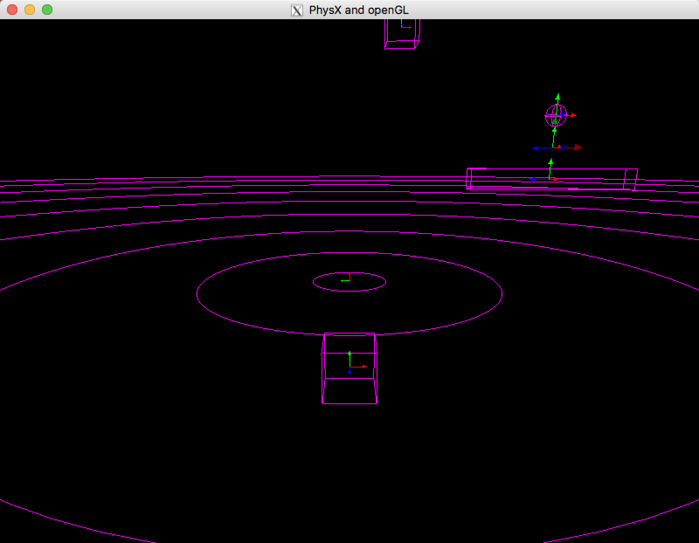
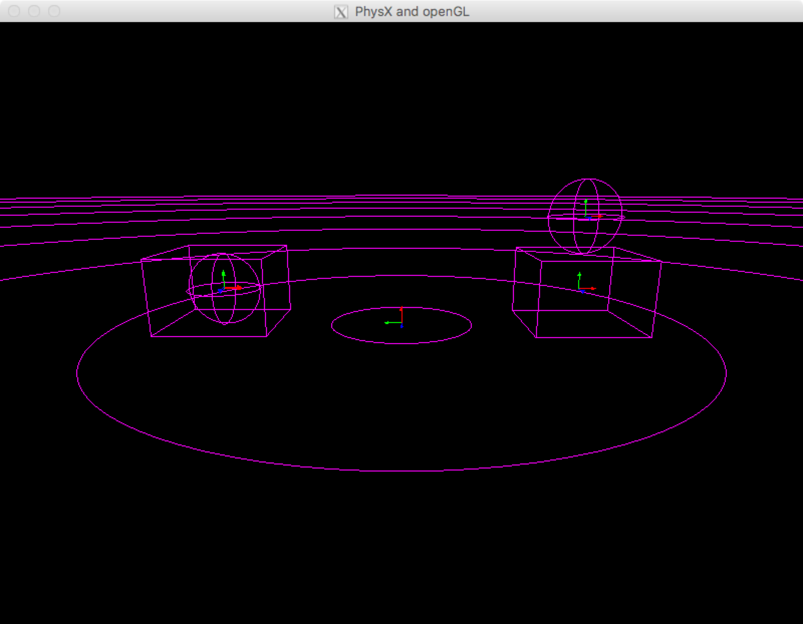
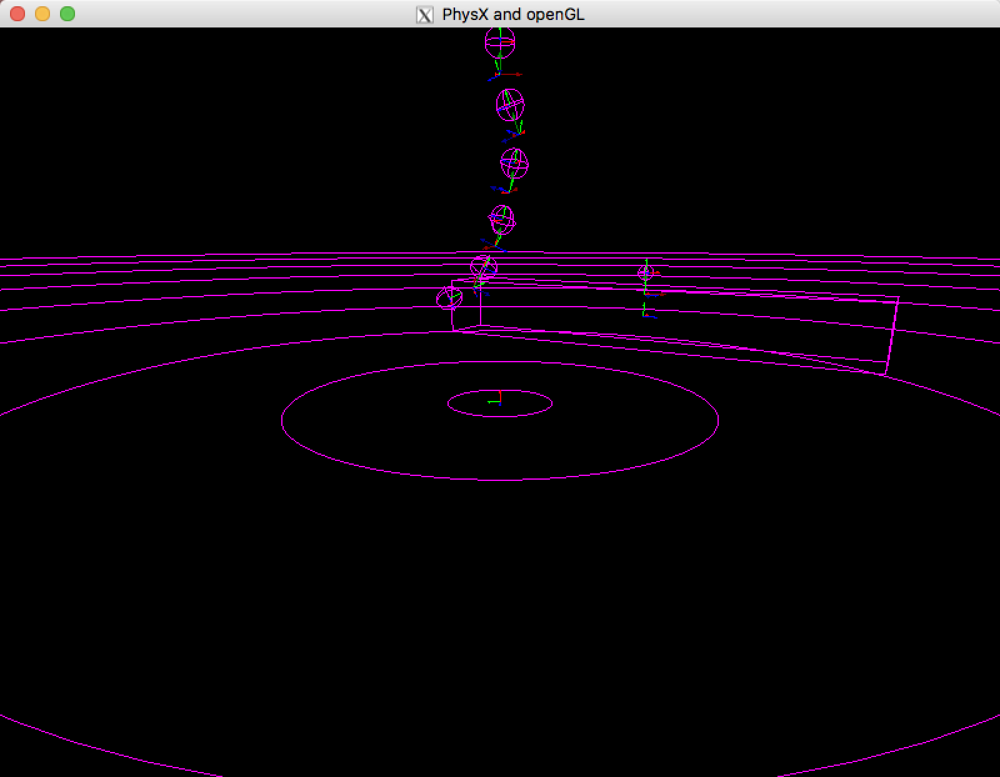
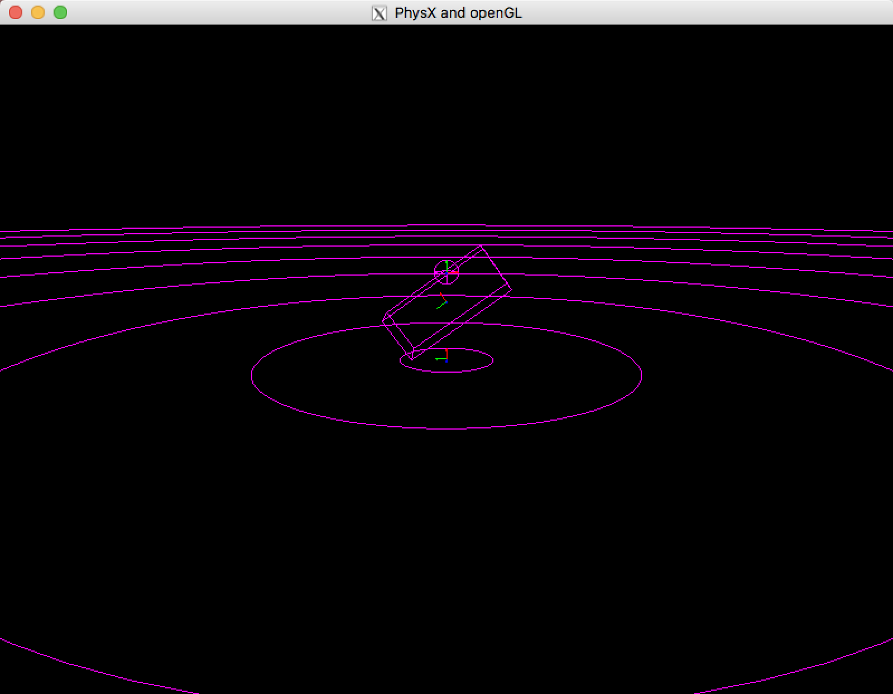
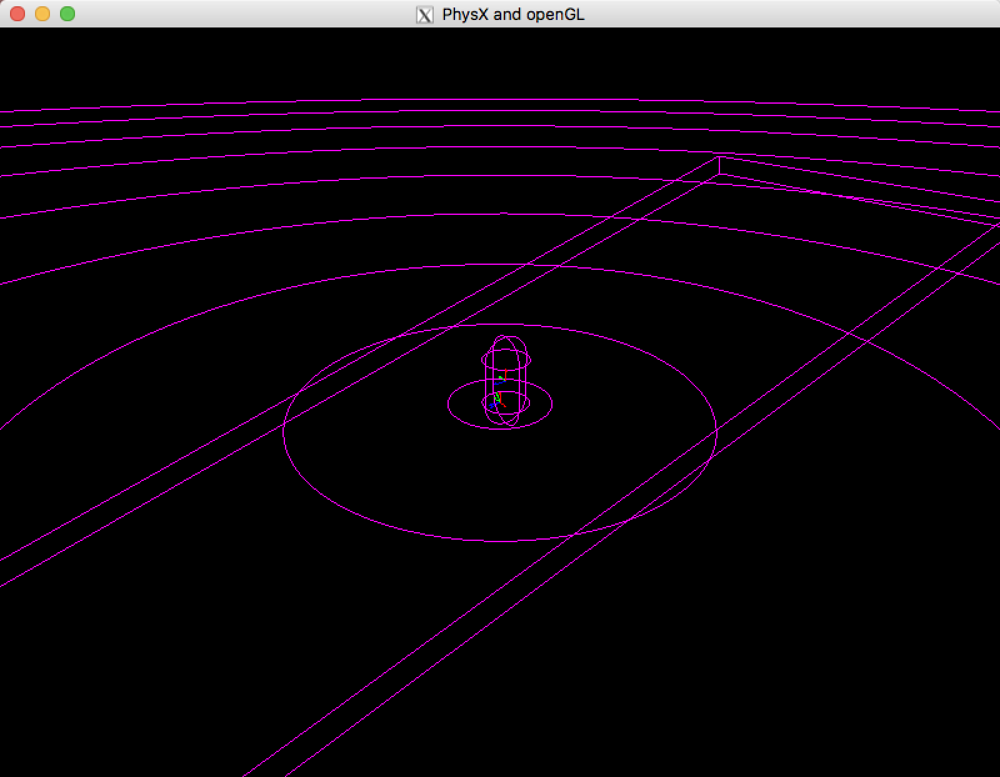
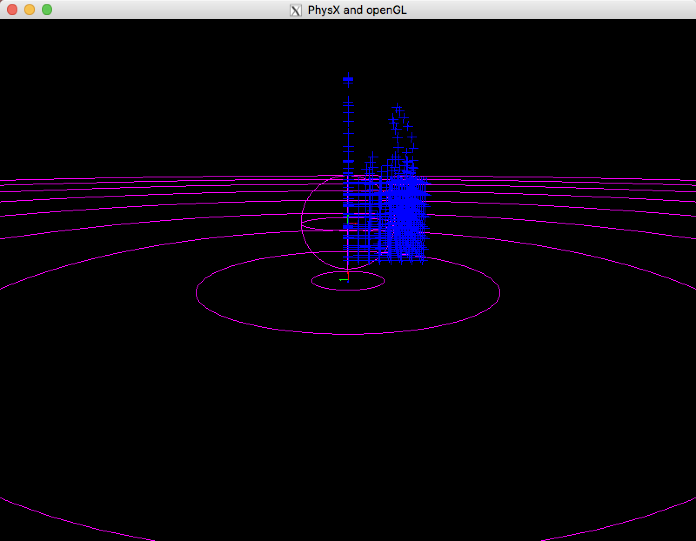
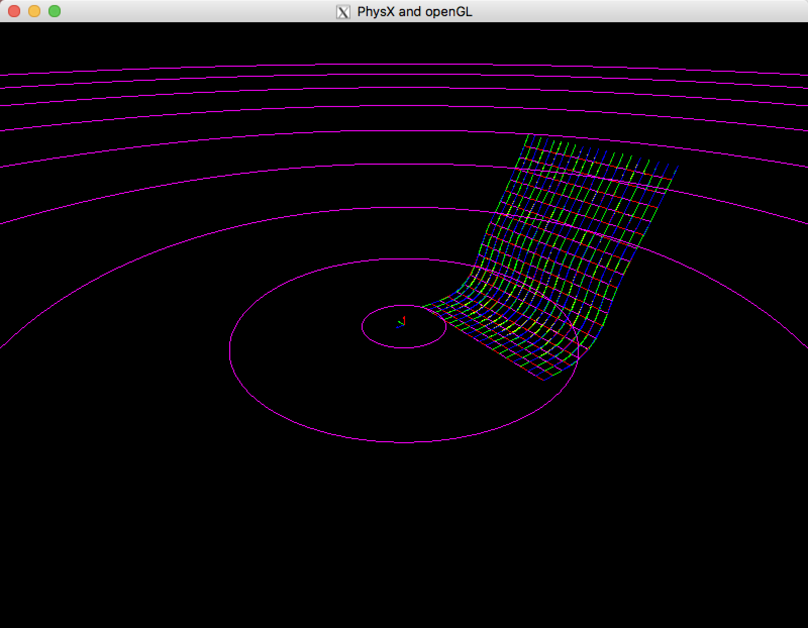

# phsyxOpenGL
learning physics modeling with physx3.4

## Screenshots

## CH3 Rigidbody

## CH4 Collision detection

## CH5 Joints

## CH6 Scene queries

## CH7 Character controller

> Use `Up` `Down` `Left` `Right` to move the character

## CH8 Particles

## Ch9 Cloth

